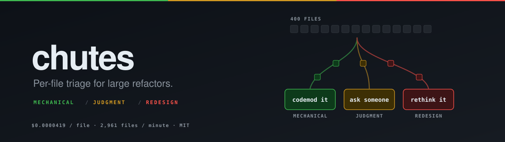
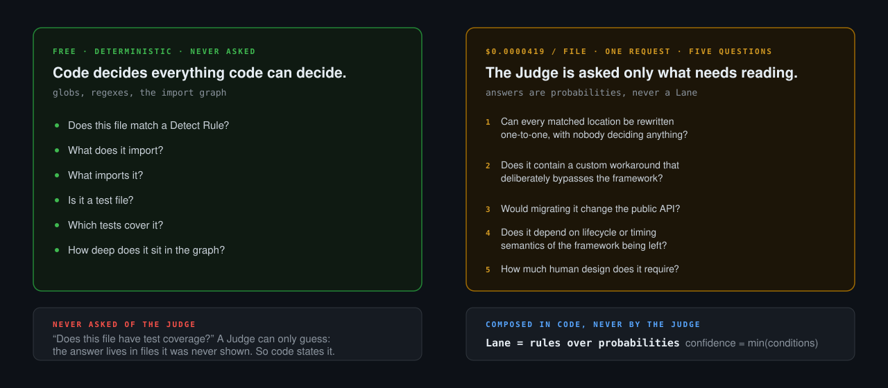

# chutes

**Per-file triage for large refactors.** A four-hundred-file migration arrives
as one number. chutes turns it into three piles you can actually staff.

[](#pre-alpha-and-not-yet-calibrated)
[](./LICENSE)
[](./package.json)
[](./tsconfig.json)
[](./measurements/README.md)

**1,008 files classified in 20 seconds for 4.2 cents.** Measured, not
estimated — the run is written up in [`measurements/`](./measurements/README.md),
including the part where it found something wrong with the tool.

<!--
  HERO DEMO — not yet recorded. Capture it, drop the files in assets/, and
  replace this comment with:

  <a href="assets/demo.mp4"></a>

  See assets/README.md for exactly what to record and the commands to do it.
-->

## Pre-alpha, and not yet calibrated

Two warnings come before anything else, because they decide whether this tool
is useful to you today.

**This is pre-alpha.** Commands, configuration keys and output formats will
change without notice. There is no stable release.

**The classification is not calibrated.** chutes reports a confidence number
with every decision, but nobody has yet measured whether that number is honest
— whether the files it calls 90% confident are right about 90% of the time.
Treat every result as a suggestion to a human reviewer. **Do not wire it into
anything that acts unsupervised.**

## The number that isn't a plan

A large refactor arrives as one number: *four hundred files*. That number tells
you nothing you can plan with. Some of those files are a find-and-replace. Some
need somebody who remembers why the code is shaped that way. A few should not
be migrated at all — they should be redesigned.

Reading four hundred files to find out which is which costs more than doing
some of the work. So the usual answer is to not find out: assign the whole
thing to whoever is free, and discover the hard files in code review, weeks
later, when the plan has already been committed to.

## Three Lanes

| Lane | Meaning | Who does it |
| --- | --- | --- |
| **Mechanical** | The change is deterministic. | A codemod, or a junior engineer with the pattern in front of them. |
| **Judgment** | The change is clear, the context is not. | Someone who knows why this code exists. |
| **Redesign** | The file should not be migrated as it stands. | A designer of the new thing. Migrating it faithfully preserves the problem. |

Files that match no rule are **Untouched** — the Migration does not reach them.

The output is a **Plan**: `plan.jsonl` for machines, `PLAN.md` for people. Both
are committed to version control, so the triage is reviewable in a pull request
and diffable as the work lands.

<!--
  PLAN.md SCREENSHOT — not yet captured. Replace this comment with:

  

  See assets/README.md.
-->

## Try it

```sh
# See what is actually in your codebase, before writing any configuration.
npx chutes init --report

# Write a configuration skeleton.
npx chutes init

# Check your Detect Rules match what you expect. Contacts nothing.
npx chutes detect --dry-run

# See exactly what would be sent to the Judge for one file. Sends nothing.
npx chutes scan --print-state src/some/file.ts

# Classify. Prints the estimated cost and waits for confirmation first.
npx chutes scan
npx chutes status
```

`init --report` comes first on purpose. Nobody knows what their Detect Rules
should be before seeing what is in the codebase, so chutes shows you that
first, and never tries to interview you about it. Add `--json` when a coding
agent, rather than a person, is going to read it.

## What code decides, and what the Judge is asked



This division is the core design decision, and it is deliberate.

**Code decides everything code can decide.** Whether a file matches your Detect
Rules, what it imports, what imports it, whether it is a test file, which tests
cover it, how deep it sits in the graph. These are facts. They come from globs,
regexes and the import graph, and they cost nothing.

**The Judge is asked only what genuinely needs reading.** Whether a matched
change is mechanical or context-dependent. Whether the file's current shape is
worth preserving. These are judgments about code that a static rule cannot make.

Facts are never sent to the Judge to be re-derived. A Judge asked *"does this
file have test coverage?"* can only guess, because the answer lives in **other
files it was never shown** — so chutes computes it and states it, rather than
asking. Every question the Judge is asked is one it is in a position to answer,
and the answers are composed into a Lane **in code**, never by the Judge.

Confidence is the **minimum** across the conditions that produced the Lane, not
their product. Seven correlated questions at 0.9 each multiply out to 0.48,
which is nonsense; the minimum is both defensible and explainable, which is what
lets chutes tell you *which single question* held a file's confidence down.

## Why it moves

| | Assumed at design time | Measured |
| --- | --- | --- |
| Cost per file | $0.0001 | **$0.0000419** |
| Throughput | 1,000 files/min | **2,961 files/min** |

Measured on 2026-09-19 against 1,008 files on model `jev-1.13.0`. A
thousand-file repository costs about four cents and takes about twenty seconds.

The run also sustained 2,961 requests per minute against a documented 1,200 RPM
limit with no rejections, so the documented ceiling is not one you should plan
throughput around in either direction.

## Evidence and limits

There is no accuracy figure in this README, because there is no accuracy figure.

That same measured run found that **not one of those 1,008 files was classified
Mechanical** — including a dozen trivial components hand-labelled as such. A
`Badge` component that renders one prop came back at `0.82` against an `0.85`
threshold and missed by three hundredths. Separating mechanical work from the
rest is the entire point of the tool, so this is the most important thing
currently known about it.

The threshold was deliberately **not** retuned to make the fixtures pass. Fitting
a number to labels written by the same person who chose the number is not
evidence. Finding where the line belongs is what Calibration is for, and
Calibration does not exist yet.

A fixture suite ([`fixtures/`](./fixtures/README.md)) catches regressions: it
checks that a change to the questions or the composition rules does not silently
change how known files are classified. **That is a regression check, not
evidence of accuracy.** It proves chutes still does what it did yesterday. It
says nothing about whether yesterday was right.

## Small enough to read

3,921 lines of TypeScript across 40 files, 109 tests. If you want to argue with
a decision, these are the files that encode one:

| File | Lines | What it decides |
| --- | --- | --- |
| [`src/plan/lane.ts`](src/plan/lane.ts) | 115 | How five answers become a Lane, and why confidence is a minimum |
| [`src/judge/questions.ts`](src/judge/questions.ts) | 72 | The five questions, and the Criteria for each level |
| [`src/state/assemble.ts`](src/state/assemble.ts) | 124 | Exactly what the Judge sees, and what gets cut when it does not fit |
| [`src/graph/facts.ts`](src/graph/facts.ts) | 133 | Everything computed instead of asked |
| [`src/plan/fingerprint.ts`](src/plan/fingerprint.ts) | 109 | Which settings invalidate a Plan, and which do not |
| [`src/plan/rescan.ts`](src/plan/rescan.ts) | 149 | Why finishing a file does not erase its record |
| [`src/judge/types.ts`](src/judge/types.ts) | 108 | The Judge seam — swap the backend, keep the tests offline |

## Status

| Working | Not yet |
| --- | --- |
| `chutes init` | Waves and scheduling |
| `chutes init --report` | Calibration |
| `chutes detect --dry-run` | `chutes next` / `done` / `fail` |
| `chutes config validate` | The editor plugin |
| `chutes scan` (replay and Jev) | |
| `chutes status` and `PLAN.md` | |

**Waves** — dependency depth from a topological sort of the import graph, so
leaves come before the modules that import them — are designed but not built.
Waves are *depth*; Lanes are *difficulty*. They are independent, and chutes will
never mix them.

## Development

```sh
pnpm install
pnpm test        # 109 tests, no network, no API key
pnpm typecheck
pnpm lint
```

The default suite never touches the network and never needs a key. The Jev
backend is exercised by an opt-in file that skips itself unless
`TYPESAFE_API_KEY` is set.

## Feedback wanted

The most useful thing you can report right now is **a Detect Rule that fails
against a real codebase**: a pattern that matched what it should not have, or
missed what it should have caught. That is the part which cannot be worked out
from first principles, and it has to be right before classification accuracy is
even worth discussing.

[Open an issue.](https://github.com/PaulChen79/chutes/issues)

## Licence

[MIT](./LICENSE)
